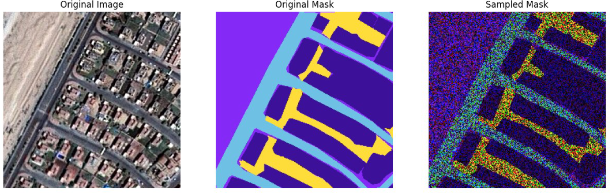
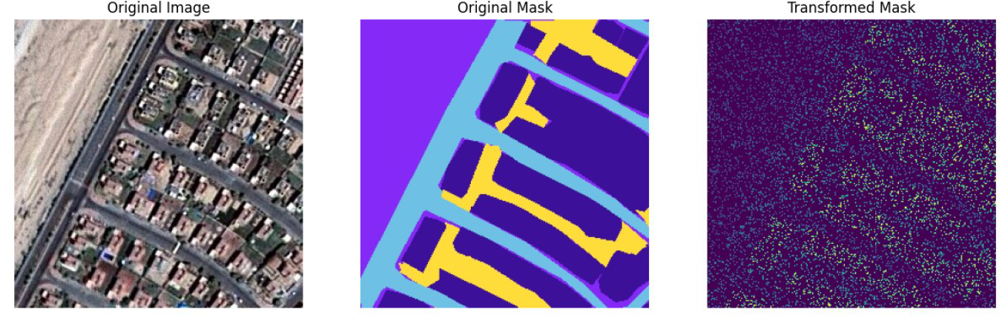
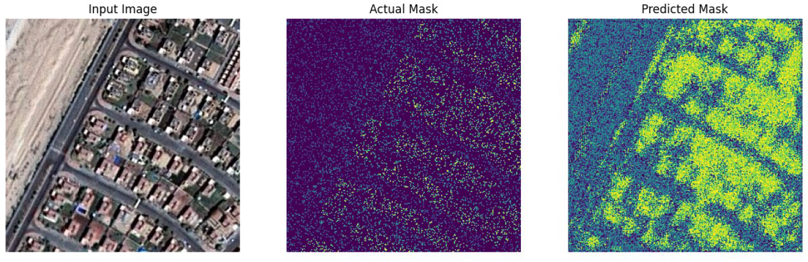

# Satellite Image Segmentation using Deep Learning

This project focuses on segmenting satellite images using a deep learning model. The goal is to classify different regions in the images (e.g., land, roads, buildings, vegetation, water) using a custom SegNet architecture. The model is trained on patched satellite images and evaluated on a test dataset.


## Project Overview

The project involves:
- Preprocessing satellite images and masks into smaller patches.
- Training a custom SegNet model using PyTorch.
- Evaluating the model on a test dataset.
- Visualizing the results, including input images, ground truth masks, and predicted masks.

---

## Installation

1. Clone the repository:
   ```bash
   git clone https://github.com/your-username/satellite-segmentation.git
   cd satellite-segmentation

2. Install the required dependencies:
   ```bash
   pip install -r requirements.txt
   ```

3. Ensure you have the dataset in the correct directory (see [Dataset](#dataset)).

---

 ## Dataset

The dataset consists of satellite images and their corresponding masks. The images are stored in the `images` folder, and the masks are stored in the `masks` folder. The dataset should be placed in the following structure:

## Training

To train the model, run the following command:
```bash
python train.py
```

This script will:
1. Load and preprocess the data.
2. Train the model for the specified number of epochs.
3. Save the trained model to the `models/` folder.

---

## Evaluation

After training, the model is evaluated on the test dataset. The evaluation script will:
1. Load the trained model.
2. Calculate the loss and accuracy on the test dataset.
3. Visualize the results for a few samples.

To evaluate the model, run:
```bash
python evaluate.py
```

---

## Results

Here are some example results from the model:

### Input Image


### Ground Truth Mask


### Predicted Mask


---


